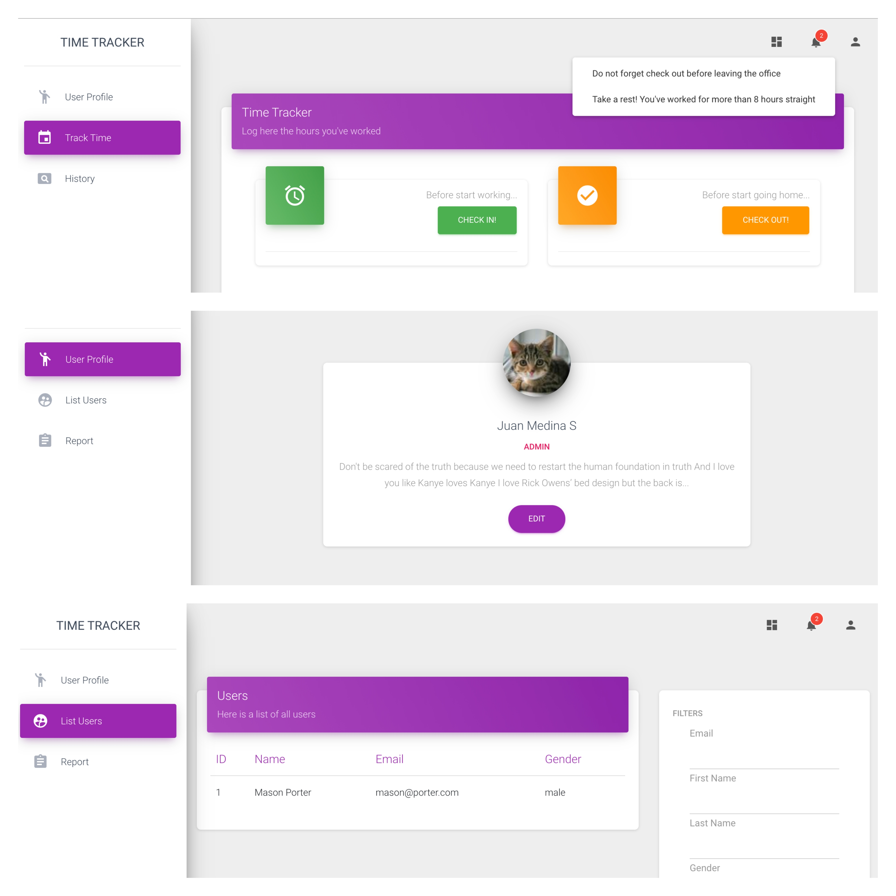

# Time Tracker

This is a web app created to track employee worked hours. It has a API backed wich provide all actions needed and a basic frontend wich consumes them. (API documentation can be found [here](https://app.swaggerhub.com/apis/jjmedinas/tracker/1.0.0))

Product specification document and requirements can be found [here.](https://docs.google.com/document/d/1qnCGQfYhNUAQUI1bXVvIS1qL3omM35ssgazLLqUKhFA/edit?usp=sharing)

#### Functional Requirements

- Create system to track employees worked hours (CheckIn CheckOut)
- Must have two roles (Admin and Employee)
- Admin Role
  - CRUD employees
  - List employees
  - Filter employees list (first_name, last_name, email, gender)
  - See report multiple users (assistances, worked hours) in a time range
- Employee Role
  - Check in / Checkout actions
  - See report (assistances, worked hours)

# Solution

#### Technologies

- Rails 6
- Postgresql
- Docker
- Unit tests with Rspec + FactoryBot
- [API Documentation (swagger)](https://app.swaggerhub.com/apis/jjmedinas/tracker/1.0.0)
- Frontend: Jquery + Bootstrap

#### Screenshots

#### Edge Cases
- Users can’t checkout without checking in first
- what to do when an user forgets checking out? (Show a notification? - Business logic decision)

#### Common Errors
 - 403 - You're not allowed to perform this action.
 - 401 - Email and password don't match.
 - 400 - Email and password don't match.
 - 400 - Check in time already set. Can't to check in again.
 - 400 - Unable to check out. Please verify check in had place and hasn't already checked out.

#### Recommendations
Some actions can be taken in order to improve the app:

- Create a setup document with steps to run project. It can be added to this readme.
- Implement a template engine (slim, haml) or event better add a frontend framework (react, vue, etc)
- Add integration tests with Capybara (It can be used to test login flow)
- Add serialization (This is a cool [gem](https://github.com/Netflix/fast_jsonapi) to do so)
- Improve foreman + webpacker setup
